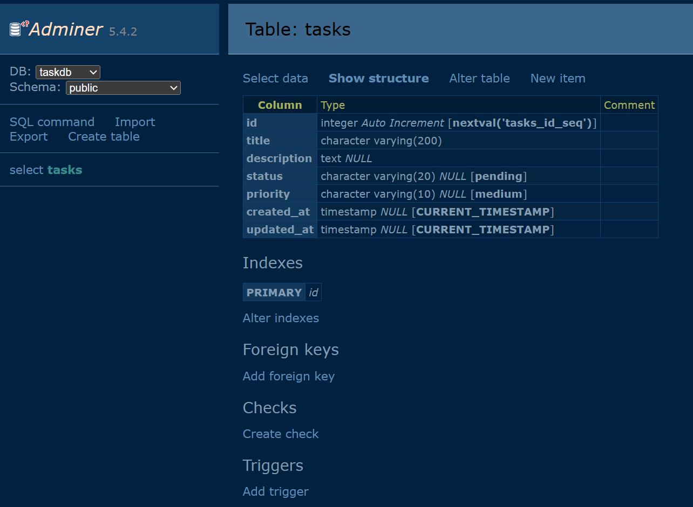
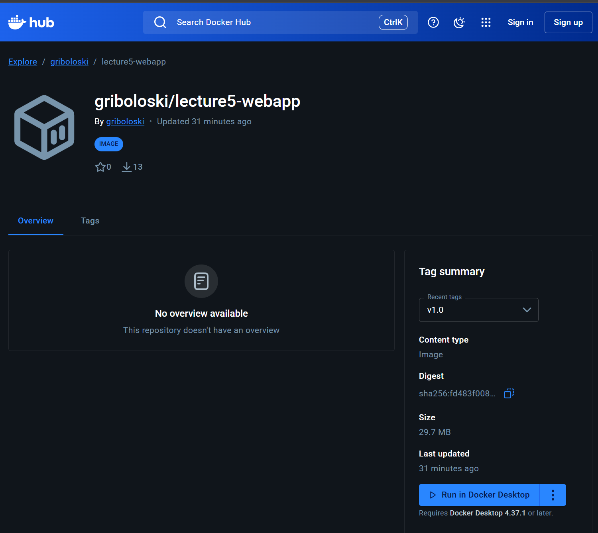
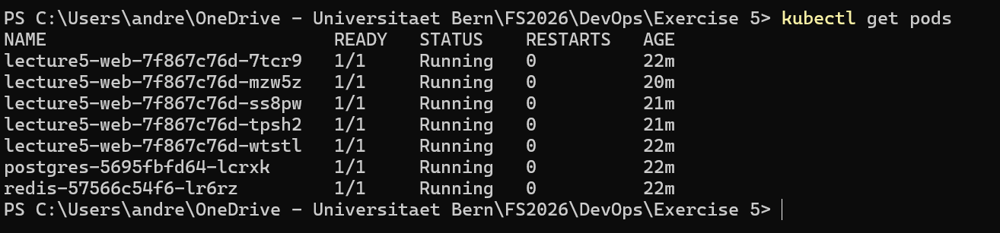
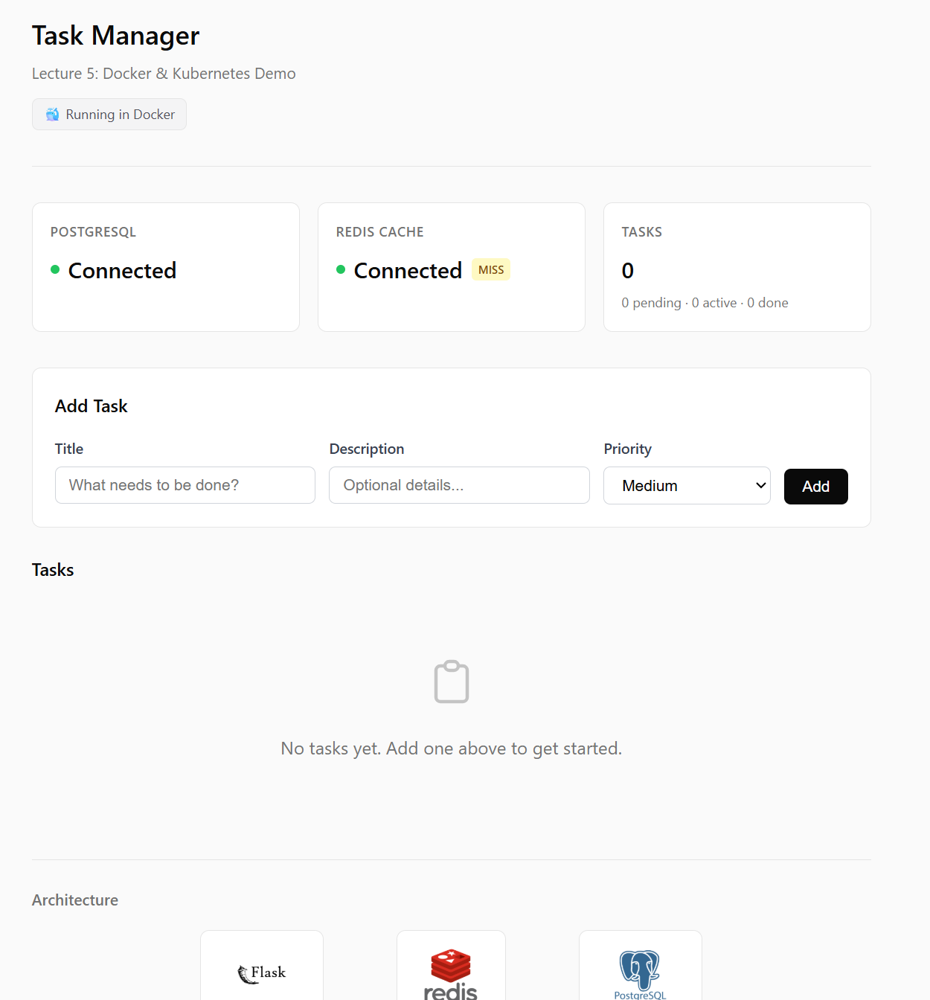
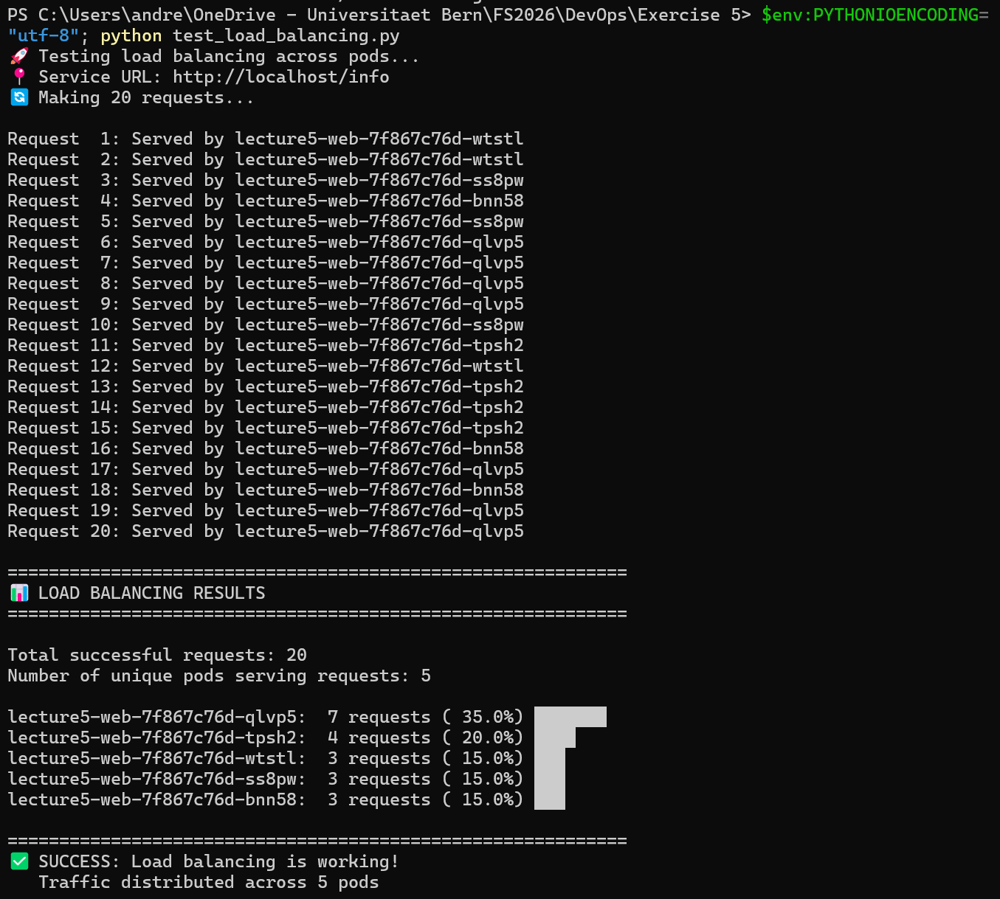
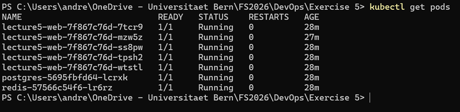
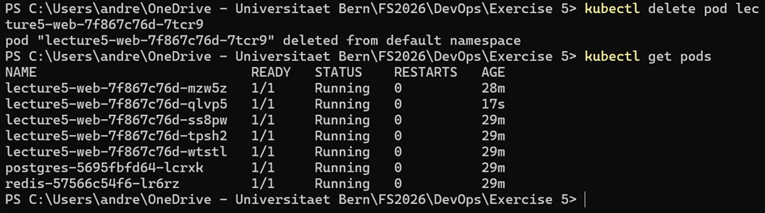
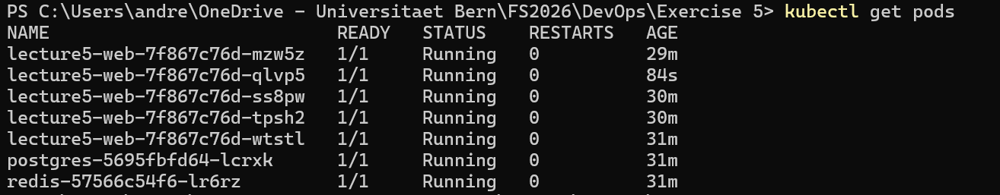

# Lecture 5: Docker & Kubernetes for Scalable Deployment

**Forked Repository:** https://github.com/griboloski/lecture5-dockerk8s-demo

**Docker Hub Username:** `griboloski`

---

## Task 1a: Add Adminer Service

Added an `adminer` service to `docker-compose.yml`:

```yaml
adminer:
  image: adminer:latest
  container_name: lecture5-adminer
  ports:
    - "8080:8080"
  environment:
    - ADMINER_DEFAULT_SERVER=db
  depends_on:
    - db
  networks:
    - app-network
  restart: unless-stopped
```

After `docker compose up -d`, Adminer is reachable at http://localhost:8080:



---

## Task 1b: Change Base Image to Alpine

Changed `FROM python:3.11-slim` to `FROM python:3.11-alpine` in the Dockerfile. Alpine needs `libpq` as a runtime dependency; no compiler toolchain is required since `psycopg2-binary` ships a pre-built musllinux wheel.

Added before `pip install`:
```dockerfile
RUN apk add --no-cache libpq
```

### Size Comparison

| Image | Size |
|-------|------|
| `task-app:slim` | 232MB |
| `task-app:alpine` | 128MB |

Alpine is ~45% smaller. Initially I installed `gcc musl-dev postgresql-dev` which bloated the image to 1.04GB — removing those and relying on the binary wheel fixed it.

---

## Task 2a: Image Tagging and Registry

```bash
docker build -t task-app:v1.0 .
docker tag task-app:v1.0 griboloski/lecture5-webapp:v1.0
docker push griboloski/lecture5-webapp:v1.0
```



---

## Task 2b: Container Inspection

- **`docker compose logs web`** — Shows stdout/stderr of the web container (Flask startup, request logs, errors).
- **`docker inspect lecture5-web`** — Returns full container metadata as JSON: network config, mounts, env vars, restart policy, port bindings.
- **`docker stats`** — Live resource usage per container: CPU%, memory, network I/O, block I/O.

---

## Task 3a: Deploy to Kubernetes

```bash
kubectl apply -f k8s-backend.yaml
kubectl apply -f k8s-web.yaml
```

Updated `k8s-web.yaml` to reference `griboloski/lecture5-webapp:v1.0`. Kubernetes was enabled via Docker Desktop, so the LoadBalancer service exposes the app at `http://localhost`.





---

## Task 3b: Scale and Test Load Balancing

```bash
kubectl scale deployment lecture5-web --replicas=5
python test_load_balancing.py
```



**How does Kubernetes distribute traffic?**
The `lecture5-web-service` (type LoadBalancer) maintains a list of pod endpoints. kube-proxy programs iptables rules that randomly distribute incoming connections across all ready pods. The endpoint list updates automatically as pods come and go.

---

## Task 3c: Self-Healing

**Before** — 5 pods running:



**Deleted pod `7tcr9`:**
```bash
kubectl delete pod lecture5-web-7f867c76d-7tcr9
```

**During** — replacement pod `qlvp5` already running after a few seconds:



**After** — back to 5/5:



**Why is self-healing important?**
The ReplicaSet controller continuously reconciles actual vs desired pod count. When a pod is killed or crashes, it gets replaced automatically. This keeps the service available without manual intervention, which is essential for production systems.

---

## Issues Encountered

| Issue | Solution |
|-------|----------|
| Alpine image bloated to 1.04GB with build tools | Only `libpq` needed; `psycopg2-binary` has a pre-built musllinux wheel |
| `test_load_balancing.py` URL pointed to minikube port | Changed `SERVICE_URL` to `http://localhost/info` for Docker Desktop |
| Kubernetes kubeconfig not created | Needed "Apply & Restart" in Docker Desktop settings |
